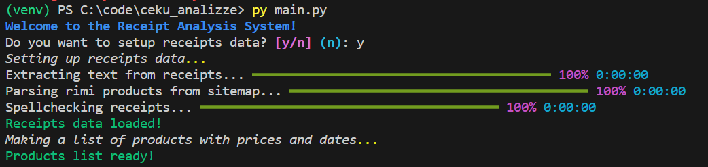
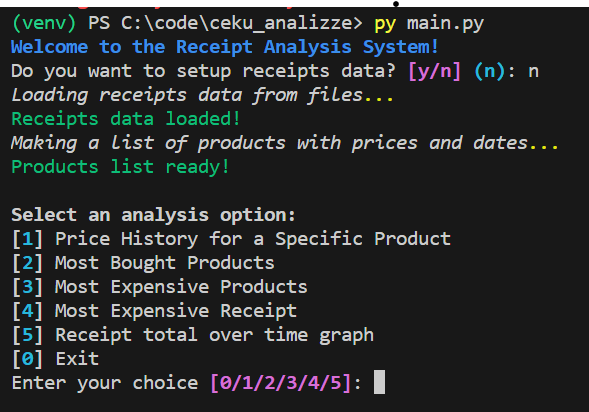
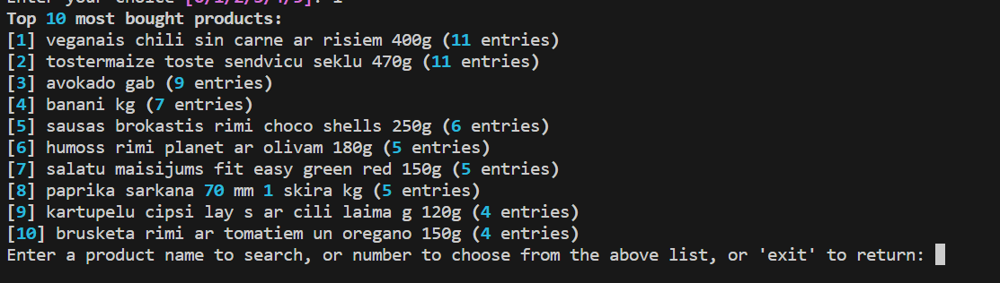
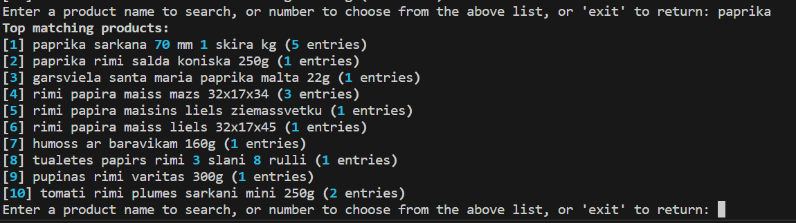
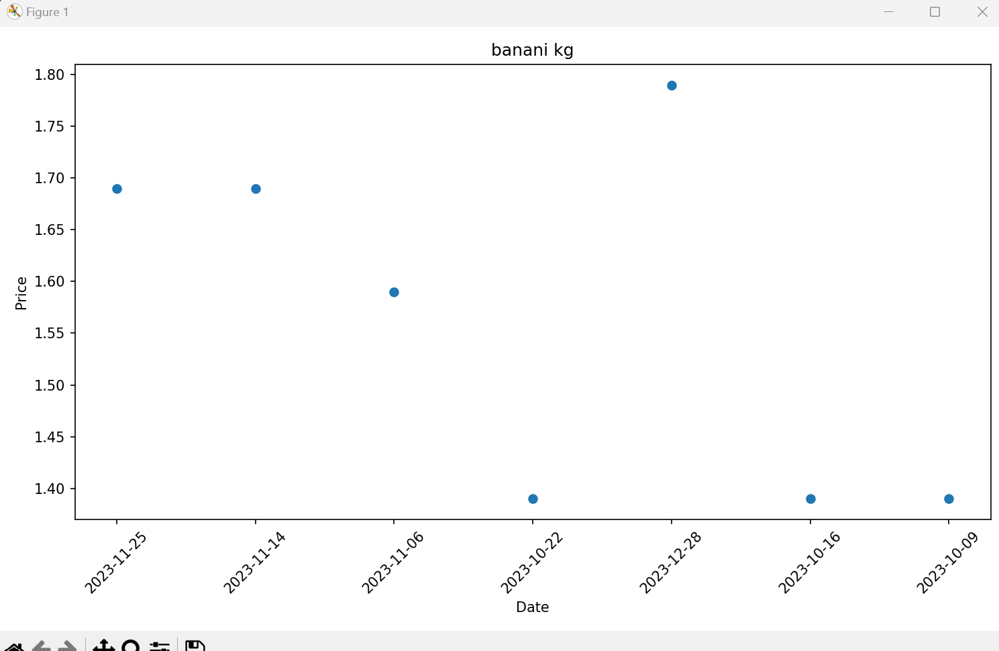
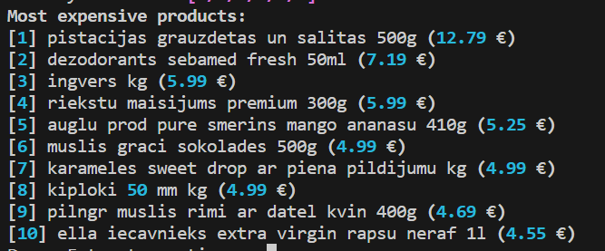
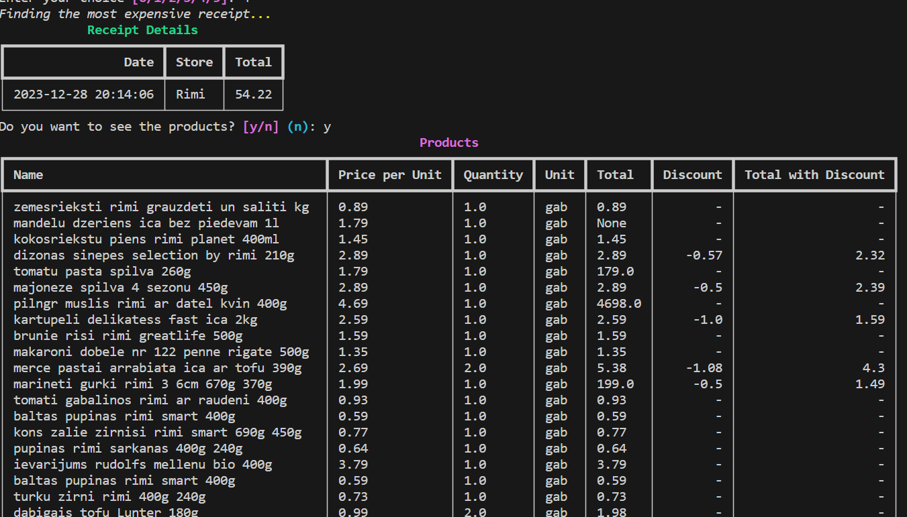
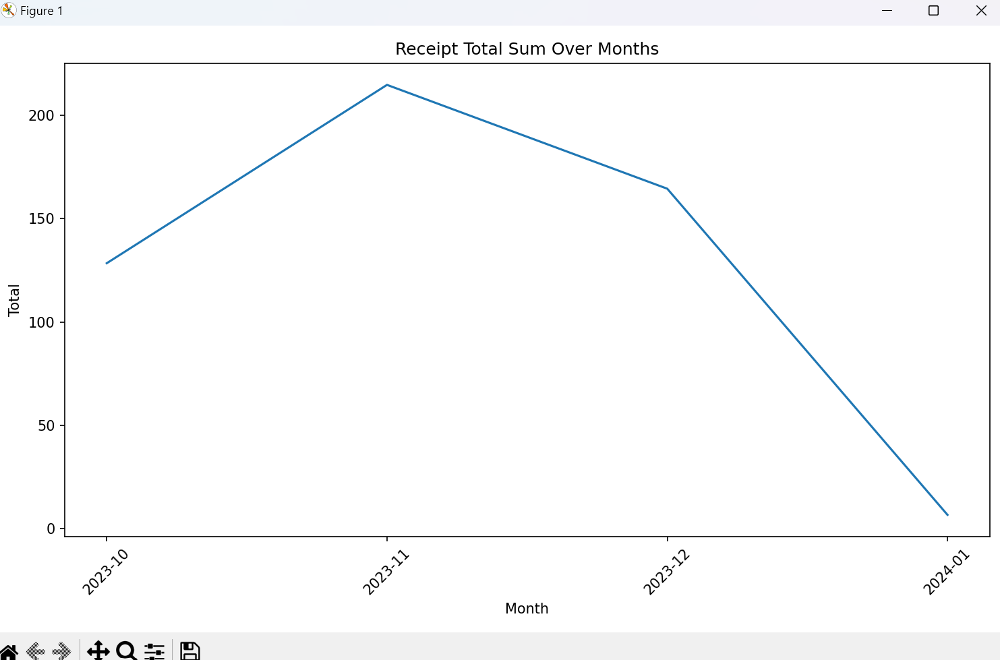
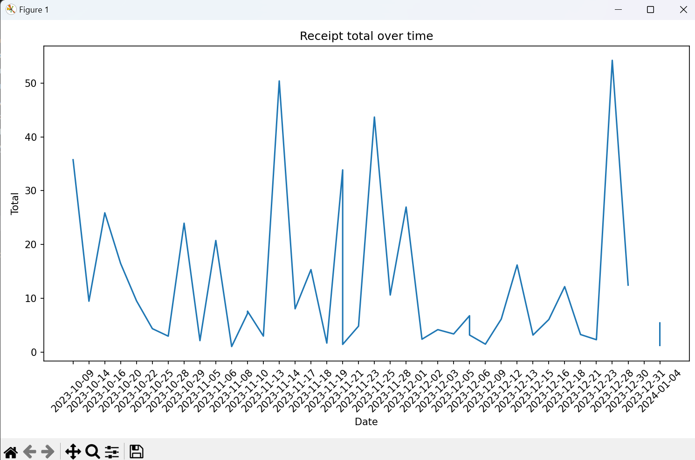

# Grocery Receipt Analysis Project

## Overview
This project analyzes rimi grocery receipts to track product prices. It uses Python and Tesseract OCR for scanning receipts. Data from Rimi e-store's sitemap is used to correct OCR results and standardize product names. Main features include:
1. Price History for a specific product
    1. Graph product price history
3. Find most bought products and graph their price history
4. Find most expensive products
5. Find most expensive receipt
6. Receipt total anaylsis
    1. option to graph for over time and to graph spent totals over month

Setting up the receipts data is optional and takes a while. The data is already loaded in.


## Repository Structure
- `receipts/`: Receipt images for OCR.
- `texts/`: OCR-scanned receipt texts.
- `receipts.txt`: Scanned receipts in dictionary format.
- `rimi_products.txt`: Product names from the Rimi sitemap.
- `receipts_spellchecked.txt`: Enhanced receipt data.

## Pictures
0. **Main menu**


1. **Price History for a specific product**


1.a **Graph product price history**

4. **Find most bought products and graph their price history**

5. **Find most expensive products**

6. **Find most expensive receipt**

7. **Receipt total anaylsis** - option to graph for over time and to graph spent totals over month



## Getting Started

### Prerequisites
- Python 3.12+
- Pip
- Tesseract OCR

### Setup and Installation
1. **Clone and Navigate:**
   ```shell
   git clone https://github.com/Hus47/ceku_analizze.git
   cd ceku_analizze
   ```

2. **Virtual Environment:**
   - **Windows**: `.\venv\Scripts\activate`

3. **Install Dependencies:**
   ```shell
   pip install -r requirements.txt
   ```

4. **Tesseract OCR (Windows):**
   - Download from [Tesseract GitHub](https://github.com/UB-Mannheim/tesseract/wiki).
   - Add to system PATH.

   Verify:
   ```shell
   tesseract --version
   ```

## Usage
Run the application and choose from the analysis options:
```shell
python main.py
```

## Technologies Used
- [Python](https://www.python.org/)
- [Tesseract OCR](https://github.com/tesseract-ocr/tesseract)
- [Rich](https://github.com/willmcgugan/rich)
- [Matplotlib](https://matplotlib.org/)

## Contributors
- **Markuss Birznieks** ([Hus47](https://github.com/Hus47))
